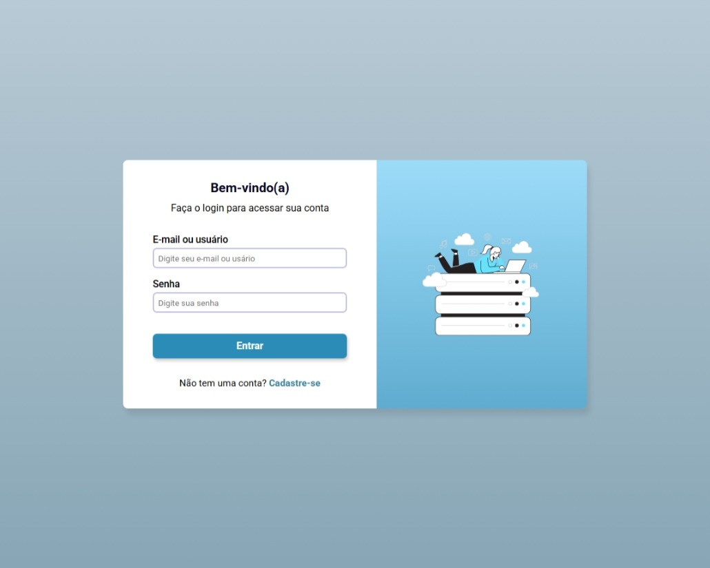
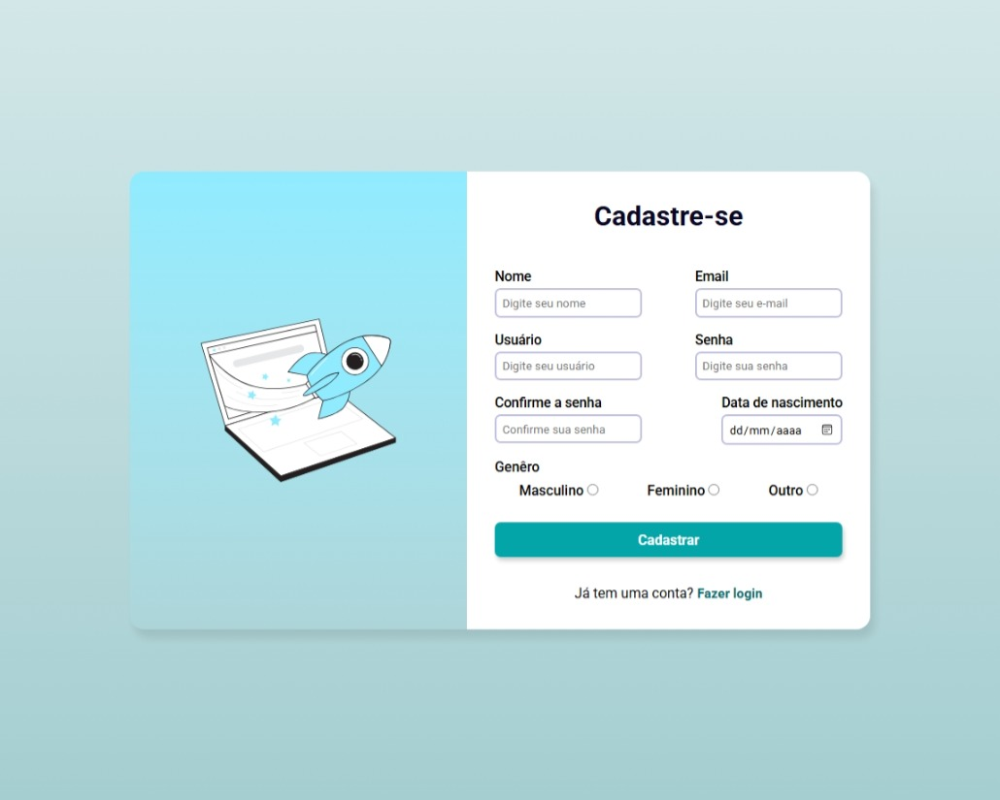

# Sistema de Login e Cadastro

Projeto de Sistema de Login e Cadastro desenvolvido com HTML5 e CSS3.
Simula uma tela de autenticação de usuários, com páginas separadas para login e cadastro.

# 🚀 Tecnologias utilizadas
**HTML5**

**CSS3**

# 🎨 Funcionalidades
**Página de Login**

* Campo de e-mail ou usuário

* Campo de senha

* Botão de login

* Link para cadastro

**Página de Cadastro**

* Nome completo

* E-mail

* Nome de usuário

* Senha e confirmação de senha

* Data de nascimento

* Gênero (Masculino, Feminino, Outro)

* Botão de cadastro

* Link para voltar ao login
